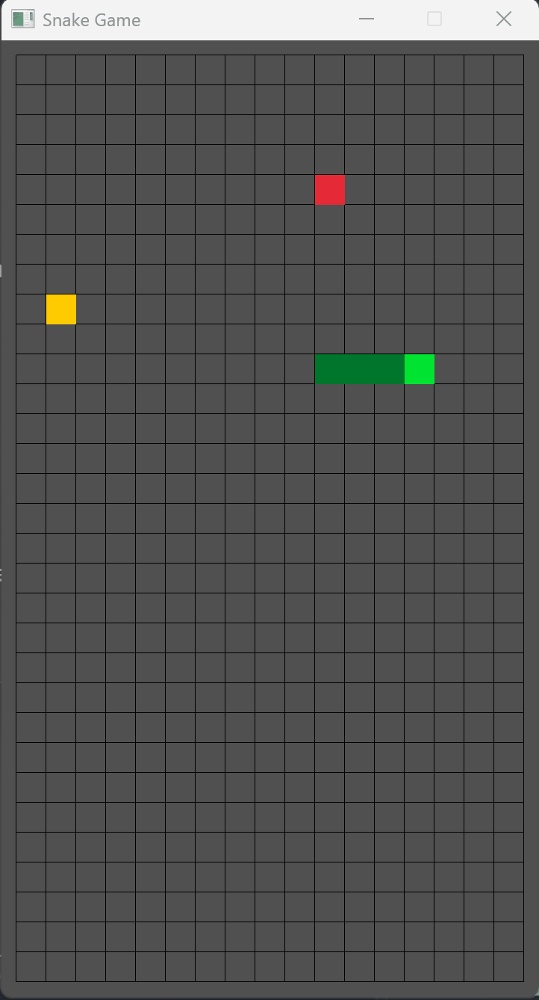

# Snake Game — A* Autopilot Edition

A modern, grid‑based Snake game built in **C++** using **raylib**, featuring:

- Smooth classic Snake gameplay  
- A* pathfinding autopilot  
- Special fruit that activates auto‑mode  
- Real‑time path visualization  
- Clean grid‑based architecture  
- Mobile‑friendly layout options  

This project is both a fun game and a clean reference for implementing A* pathfinding in a tile‑based environment.

---

## Features

### Classic Snake Gameplay
- 4‑direction movement  
- Growing tail mechanics  
- Self‑collision and border detection  
- Configurable tile size and grid  

### A* Autopilot Mode
- Activated by eating a special fruit  
- Computes shortest safe path to the next fruit  
- Avoids the snake’s body  
- Prevents diagonal or invalid moves  
- Recomputes path only when necessary  

### Path Visualization
- Shows the exact route A* will follow  
- Uses a stable debug path to prevent flickering  
- Great for debugging and learning pathfinding  

### Two Fruit Types
- **Normal Fruit** → grows the snake  
- **Special Fruit** → activates autopilot for 10 seconds  

### 📱 Mobile‑Friendly Layout
- Works in portrait or landscape  
- Scales cleanly to 720×1280 or 1080×1920  

---

## How the A* Autopilot Works

The autopilot uses a standard **A\*** search over a 4‑direction grid:

- **Nodes** → grid cells  
- **Edges** → up, down, left, right  
- **Heuristic** → Manhattan distance  
- **Blocked cells** → snake body, borders  
- **Valid moves** → exactly 1 tile in one axis (no diagonals)  

The algorithm returns a list of grid cells representing the shortest safe path.  
The game then:

1. Stores the full path in `debugPath` (for drawing)  
2. Stores the movement path in `autoPath` (for execution)  
3. Pops one step per movement tick  
4. Recomputes only when needed  

This ensures smooth, stable autopilot behavior.

---

## 🛠️ Technologies Used

- **C++20**  
- **raylib**  
- **std::vector**, **std::priority_queue**, **unordered_map**  
- Custom grid/world coordinate conversion  
- Custom A* implementation  

---

